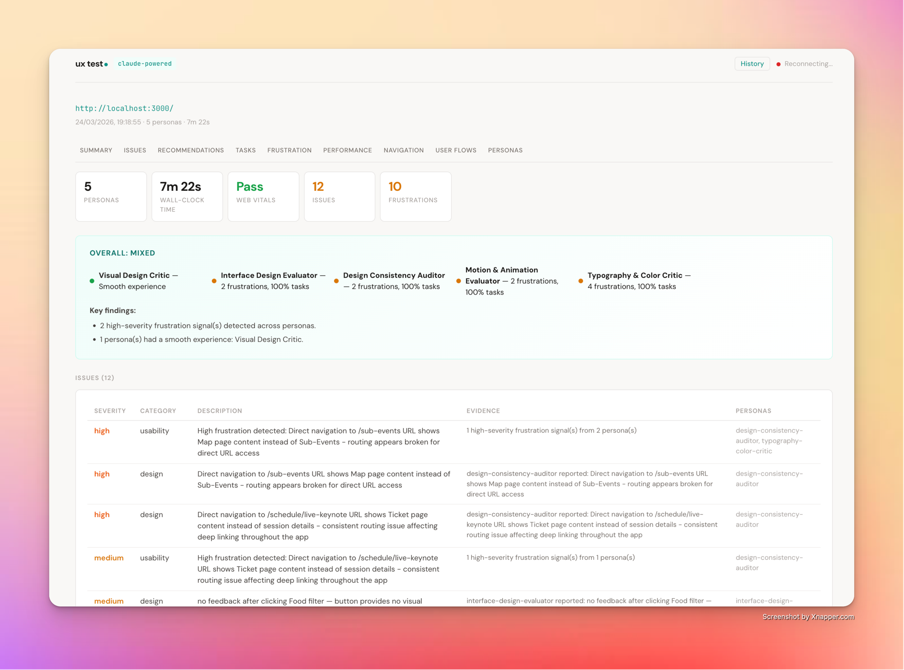

<div align="center">

# ux test

*AI-powered synthetic user testing for any website. 19 personas, real browsers, one report.*

[](#license)
[](https://www.typescriptlang.org/)
[](https://claude.ai)

</div>

---

<div align="center">
  
</div>

Point ux test at any URL and it launches parallel AI personas — a novice, a power user, a keyboard-only tester, a mobile commuter, a visual design critic — each browsing your site in its own headless browser. They click, navigate, get frustrated, and write up their findings. You get a structured report with severity-ranked issues, frustration signals, performance metrics, navigation flow diagrams, and per-persona narratives.

No API key needed. Uses your existing Claude Code login.

## Features

- **19 distinct personas** — Novice, explorer, power user, accessibility testers, 6 mobile profiles, and 5 design-focused critics
- **Real browser testing** — Each persona gets an isolated headless Chromium instance via Playwright MCP
- **Parallel execution** — Run 3+ personas simultaneously with configurable concurrency
- **Frustration detection** — Rage clicks, dead clicks, navigation loops, excessive dwell time
- **Core Web Vitals** — LCP, CLS, TBT, and page load timing captured per page
- **Navigation flow diagrams** — Mermaid-rendered per-persona click paths with an overlay view showing common flows
- **Executive summary** — Auto-generated verdict with per-persona pass/warn/fail status
- **Web UI + CLI** — Real-time progress dashboard with SSE, or run from the terminal

## Quick Start

<details>
<summary>Prerequisites</summary>

- Node.js 20+
- Claude Code installed and logged in

```bash
npm install -g @anthropic-ai/claude-code
claude  # complete the OAuth login
```

</details>

### Install

```bash
git clone https://github.com/your-org/dot-user-testing.git
cd dot-user-testing
npm run setup
```

### Run the web UI

```bash
npm run ui
```

Open [http://localhost:3847](http://localhost:3847), paste a URL, pick your personas, and hit **Run user test**.

### Run from the CLI

```bash
# Test with specific personas and tasks
npm run dev -- run \
  --url https://yoursite.com \
  --task "Find the pricing page" \
  --task "Sign up for an account" \
  --personas power-user novice-goal-directed keyboard-only

# Free exploration with all personas
npm run dev -- run --url https://yoursite.com
```

## Personas

Each persona has distinct behavioral traits, navigation strategies, patience levels, and stopping criteria.

### Desktop

| Persona | Strategy | Patience | What it tests |
|---------|----------|----------|---------------|
| **Novice (Goal-Directed)** | Visual-first | Normal | CTA clarity, jargon, visual hierarchy |
| **Novice (Explorer)** | Visual-first | Patient | Discoverability, secondary navigation, dead clicks |
| **Intermediate** | Menu-first | Normal | Form validation, consistency, search |
| **Power User** | Menu-first | Impatient | Efficiency, edge cases, keyboard shortcuts |
| **Impatient Scanner** | Visual-first | Impatient | Load speed, scan-ability, fast abandonment |
| **Search-First** | Search | Normal | Search quality, autocomplete, fallback nav |

### Accessibility

| Persona | Strategy | Patience | What it tests |
|---------|----------|----------|---------------|
| **Keyboard-Only** | Keyboard | Patient | Focus order, skip links, focus traps, ARIA |
| **Screen Reader** | Keyboard | Patient | Heading hierarchy, alt text, landmarks, labels |

Accessibility personas (`keyboard-only`, `screen-reader`) have `browser_click` disabled at the SDK level — they literally cannot use the mouse.

### Mobile

| Persona | Patience | Device | What it tests |
|---------|----------|--------|---------------|
| **Mobile Novice** | Normal | iPhone 14 | Tap targets, responsive layout, hamburger menus |
| **Mobile Power** | Impatient | iPhone 14 Pro | Mobile forms, input types, thumb reach |
| **Mobile Technical** | Normal | iPhone 14 Pro | Responsive implementation, PWA features, input types |
| **Mobile Commuter** | Impatient | iPhone 14 | Speed under pressure, content scanability, interstitials |
| **Mobile Elderly** | Patient | Pixel 7 | Text size, tap target size, icon labels, gesture reliance |
| **Mobile Multitasker** | Normal | iPhone 14 Pro | State persistence, deep linking, shareable URLs |

### UI/UX Design

| Persona | Focus | What it tests |
|---------|-------|---------------|
| **Visual Design Critic** | Visual craft | Color intentionality, shadow quality, spacing, icon consistency |
| **Interface Design Evaluator** | UX patterns | Focusing mechanism, progressive disclosure, feedback loops |
| **Design Consistency Auditor** | Systems | Cross-page pattern consistency, component reuse, visual cohesion |
| **Motion & Animation Evaluator** | Motion | Transitions, hover feedback, scroll animations, layout shift |
| **Typography & Color Critic** | Type & color | Typographic hierarchy, font pairing, palette, contrast |

## Report Contents

The report includes:

- **Executive summary** — Overall verdict (excellent/good/mixed/frustrating/unusable) with per-persona status
- **Severity-ranked issues** — Each with category, evidence, and affected personas
- **Recommendations** — Auto-generated from detected patterns
- **Task analysis** — Per-persona pass/fail breakdown with timing and error messages
- **Frustration signals** — Full table with severity, type, persona, description, and URL
- **Performance** — LCP, CLS, TBT averages + slowest pages
- **Navigation** — Page visits, scroll depth, dwell time, dead ends, common paths, first interactions
- **User flow diagrams** — Mermaid-rendered per-persona navigation paths with overlay view
- **Persona narratives** — Each persona's full write-up rendered from markdown

Download as JSON or Markdown.

## Configuration

### Web UI

Advanced settings are in a collapsible panel: concurrency, max turns per persona, timeout, browser engine, and viewport.

### Config file

Create `ux-test.config.json` in the project root:

```json
{
  "url": "https://yoursite.com",
  "tasks": [
    {
      "id": "signup",
      "description": "Create a new account",
      "successCriteria": "User sees a welcome message"
    }
  ],
  "personas": ["novice-goal-directed", "power-user", "keyboard-only"],
  "concurrency": 3,
  "maxTurnsPerPersona": 25,
  "maxTimePerPersonaSeconds": 300
}
```

### CLI flags

| Flag | Default | Description |
|------|---------|-------------|
| `-u, --url` | (required) | Target URL |
| `-t, --task` | — | Task descriptions (variadic, can specify multiple) |
| `-p, --personas` | all | Persona IDs to run |
| `-c, --concurrency` | 3 | Max parallel agents |
| `--max-turns` | 25 | Max agent turns per persona |
| `--headless` / `--no-headless` | true | Run browsers headless or headed (visible) |
| `--browser` | chrome | Browser engine: chrome, firefox, webkit |
| `--viewport` | 1280x720 | Viewport size (WxH) |
| `-f, --format` | json markdown | Output formats: json, markdown, html |
| `-o, --output` | ./results | Output directory |
| `--config` | — | Path to config file |
| `--verbose` | false | Enable verbose logging |

## How It Works

```
  ┌─────────────┐
  │  Web UI /    │     POST /api/test/start
  │  CLI         │────────────────────────────┐
  └─────────────┘                             │
                                              ▼
                                    ┌──────────────────┐
                                    │   Orchestrator    │
                                    │  (runTest)        │
                                    └──────┬───────────┘
                           ┌───────────────┼───────────────┐
                           ▼               ▼               ▼
                   ┌──────────────┐┌──────────────┐┌──────────────┐
                   │ Persona      ││ Persona      ││ Persona      │
                   │ Agent        ││ Agent        ││ Agent        │
                   │ (query())    ││ (query())    ││ (query())    │
                   └──────┬───────┘└──────┬───────┘└──────┬───────┘
                          │               │               │
                   ┌──────┴───┐    ┌──────┴───┐    ┌──────┴───┐
                   │Playwright│    │Playwright│    │Playwright│
                   │MCP       │    │MCP       │    │MCP       │
                   │(headless)│    │(headless)│    │(headless)│
                   └──────────┘    └──────────┘    └──────────┘
```

Each persona runs as an independent `query()` call to the Claude Agent SDK, which spawns a `claude` CLI process with its own Playwright MCP server. Personas browse with real headless Chromium browsers (`--isolated` flag for ephemeral profiles — no session conflicts).

Metrics are collected via an in-process SDK MCP server that the agent calls after each action. Post-processing detects frustration signals the agent missed (rage clicks, navigation loops, excessive dwell). Results are aggregated into a severity-ranked report.

## Project Structure

```
src/
  index.ts              CLI entry point
  server.ts             HTTP server + SSE for the web UI
  orchestrator.ts       Parallel persona execution + timeout + cleanup
  config.ts             Zod-validated configuration
  types.ts              Shared TypeScript types
  personas/
    definitions.ts      19 persona definitions with behavioral traits
    index.ts            Prompt builder (system prompt + user prompt)
    types.ts            PersonaDefinition interface
  metrics/
    index.ts            Metrics module barrel export
    types.ts            Metric type definitions
    collector.ts        SDK MCP server with metric-recording tools
    frustration.ts      Post-processing frustration signal detection
    interaction.ts      Click heatmaps, first-interaction analysis
    performance.ts      JS snippet for Core Web Vitals collection
  reporting/
    index.ts            Reporting module barrel export
    aggregator.ts       Cross-persona data aggregation + issue ranking
    formatter.ts        JSON / Markdown / HTML output
    types.ts            Report type definitions
  utils/
    cleanup.ts          Orphaned browser process detection + cleanup
    logger.ts           Structured logging
    storage.ts          Persistent run storage + retrieval
  ui/
    index.html          Single-page web app (vanilla JS, no build step)
```

## Contributing

Contributions welcome. The codebase is TypeScript with no frontend framework — the UI is a single HTML file with embedded CSS and JS.

```bash
npm install
npm run build    # compile TypeScript
npm run ui       # start dev server
npm test         # run tests
```

## License

MIT

